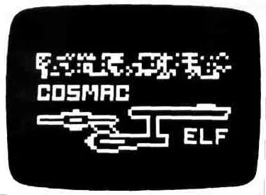
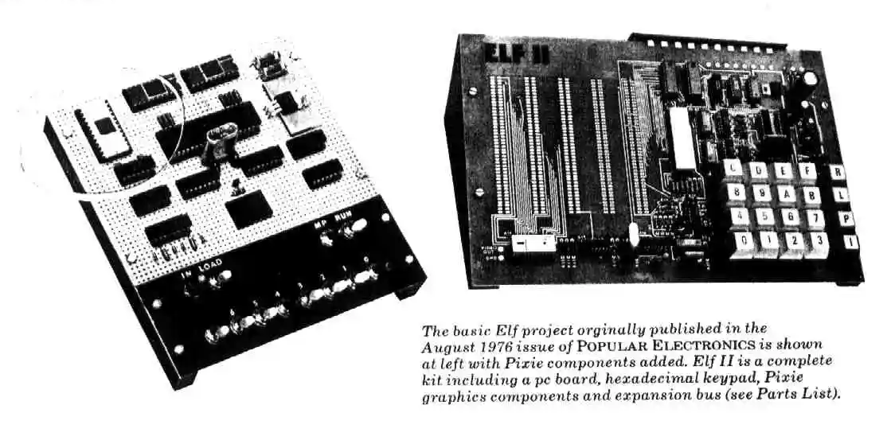

Hi, my name is Sean Wheeler. My interest in computers started in 1978 when I first learned to
program in BASIC from a book without access to a computer. My first computer was the Netronics ELF
II built from a kit. It had 256 bytes of RAM.

|                                          |                                            |
| ---------------------------------------- | ------------------------------------------ |
|  |  |

Later, I saved up my money and bought an Apple //e. This got me through my first two years of
college. By then, the PC Clone market was starting to heat up and I bought a Turbo XT clone, the
first of many PCs I would own. In college I studied Computer Science and worked as a system operator
for the university's VAX cluster. I loved the DCL scripting language in VMS. After graduation, I got
into NetWare. That paid the bills for several years. In February of 1995, I hired by Microsoft to
support Windows (WFW 3.11, LanMan 2.x, NT 3.1, & NT 3.5) for large corporate customers.

These days I am a writer for PowerShell on Microsoft Docs. I have a long history with scripting
languages. I have taught several courses on VBScript and PowerShell over the years. PowerShell is my
current favorite.

_&lt;disclaimer&gt;_

_Any views and opinions presented on this blog are my own and do not represent views or opinions of
any of my employers - past, present or future. The information presented here is provided without
warranty. Use at your own risk. Dry clean only. Use a cool iron. Don't get it wet. Don't feed it
after midnight._

_The contents of the blog are Copyright &copy; 2023 Sean Wheeler, unless otherwise stated._
_&lt;/disclaimer&gt;_