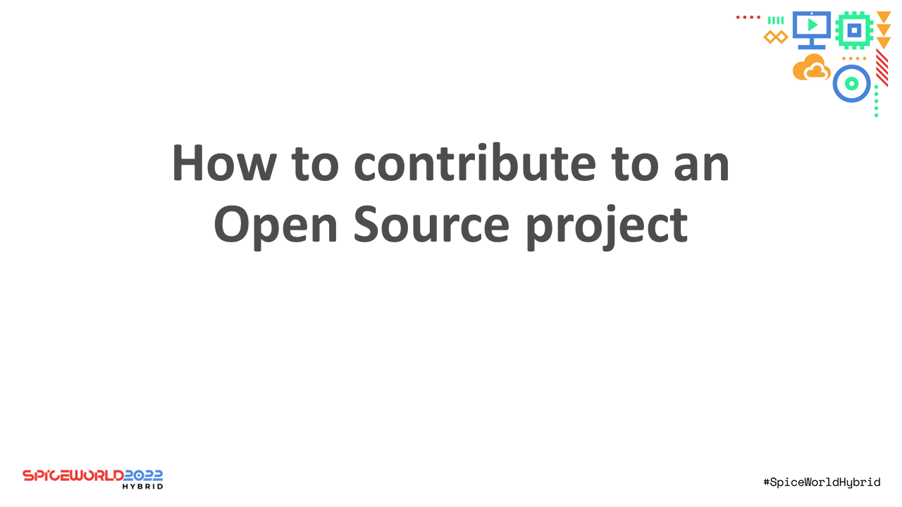

<!-- markdownlint-disable MD041 -->

Abstract: Using PowerShell as the example, I explore the different ways you can contribute to an
Open Source project. In this presentation you will learn:

- Why you should contribute
- Understanding the project guidelines including:
  - Expectations
  - Style guides
  - Etiquette
- How to use Git and GitHub
- Contributing through issues
- Submitting changes via pull requests

This presentation was delivered at SpiceWorld 2022 in Austin, TX.
